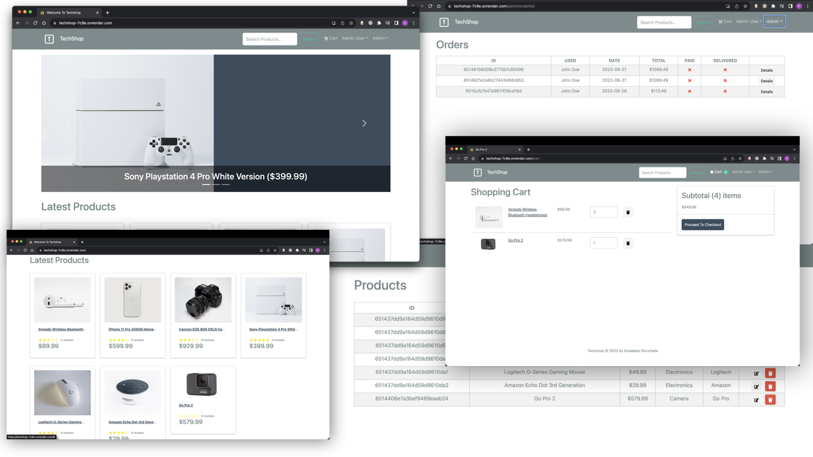

# Techshop (Ecommerce Application MERN stack)  

> Techshop is an Ecommerce progressive web aplication with fully functional features and responsive UI, built using MERN stack, redux toolkit, Render, PayPal and bootstrap framework. Features incudes shopping cart, reviews and ratings, User and Admin, search, checkout, and payment method.



As part of my proof of concept I built a fully functional E-commerce web application using React Redux, fetchbase mutations and query, DB management (Mongo) using Express with node Js as a back end and bootstrap css as front end. 
Please click here -> [Demo](https://techshop-7c9e.onrender.com/) 
>(Note: Due to the free hosting service, server takes time to load, give it a minute or so for the response)


## Table of Contents

- [Introduction](#introduction)
- [Features](#features)
- [Build Process](#run-locally)
- [Developer](#Developer)


## Introduction

> Techshop is an online shopping web applications where users can search for gadgets and add to the cart and checkout using paypal, where admins can handle (add/edit/remove) products and orders on the other hand (This App is built for POC purpose only)
- This is a single page web application where all the data is fetched and requests are made to API without reloding the page by using proide and invalidating tags.
- Used accordions to expand the data on click and add photos inside the expandable pannels
- Users, Albums, Photos can be Added and Deleted
- isLoading and isError used all accross the application to handle exceptions in case of bad server or 404 responses from the API
- Look into [features](#Features) for code snippets and more understanding.  

****

## Features

> A few of the things you can do with Photo Albums App:
> - Add/Delete Users by clicking button
> - Add/Delete albums
> - Add/Delete phhotos
- Full featured shopping cart
- Product reviews and ratings
- Top products carousel
- Product pagination
- Product search feature
- User profile with orders
- Admin product management
- Admin user management
- Admin Order details page
- Mark orders as delivered option
- Checkout process (shipping, payment method, etc)
- PayPal / credit card integration
- Database seeder (products & users)

****


## 💻 Run Locally

Clone the project

```bash
  git clone https://github.com/kuladeepperumalla/techShop.git
```

Go to the project directory

```bash
  cd techShop
```

Install dependencies
### Install Dependencies (frontend & backend)

```bash
npm install
cd frontend
npm install
```

- Get Mongo URI by creating account in MongoDB `MongoDB URI` - [MongoDB Atlas](https://www.mongodb.com/cloud/atlas/register)
- Paypal client ID from paypal account `Client ID` - [PayPal Developer](https://developer.paypal.com/)

### Env Variables

create `.env`file in the root folder and add the following

```bash
NODE_ENV = development
PORT = 5000
MONGO_URI = your mongodb uri
JWT_SECRET = 'abc123'
PAYPAL_CLIENT_ID = your paypal client id
PAGINATION_LIMIT = 8
```

### Run

```bash

# Run frontend (:3000) & backend (:5000)
npm run dev

# Run backend only
npm run server
```

## Build & Deploy

```bash
# Create frontend prod build
cd frontend
npm run build
```

### Seed Database

You can use the following commands to seed the database with some sample users and products as well as destroy all data

# Import data
```bash
npm run data:import
```

# Destroy data
```bash
npm run data:destroy
```


### Sample User Logins
```bash
#admin
admin@email.com 
123456

#Customer
kuldeepperumalla@email.com 
123123
```
---
### Techstack


## Developer

This project is brought to you by 🍁 [Kuladeep Perumalla](s://github.com/kuladeepperumalla).
